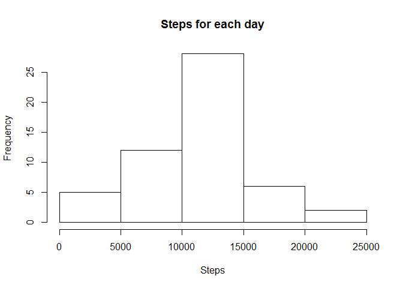
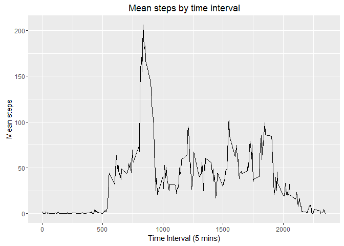
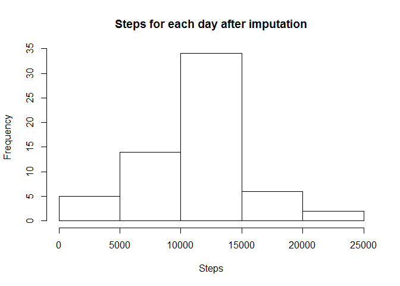
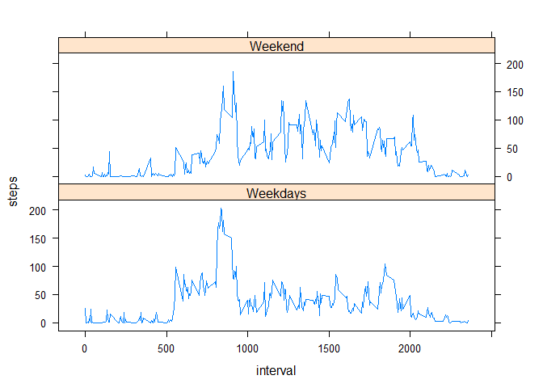

# Reproducible Research Programming  Assignment 1
Daniel Montoya  
18 de agosto de 2016  


## Loading and preprocessing the data  

```r
if (!file.exists("dataset.zip")){
    fileURL <- "https://d396qusza40orc.cloudfront.net/repdata%2Fdata%2Factivity.zip"
    download.file(fileURL, "dataset.zip")
}
if (!file.exists("activity.csv")) {
    unzip("dataset.zip")
}
activity <- read.csv("activity.csv")
```

No further preprocessing is necesary for now.  

## What is mean total number of steps taken per day?

For this part of the assignment, you can ignore the missing values in the dataset.  
Make a histogram of the total number of steps taken each day

```r
stepsday <- aggregate(steps~date,data=activity,sum,na.rm=T)
hist(stepsday$steps,xlab="Steps",main="Steps for each day")
```

<!-- -->

Calculate and report the mean and median total number of steps taken per day


```r
mean(stepsday$steps)
```

```
## [1] 10766.19
```

```r
median(stepsday$steps)
```

```
## [1] 10765
```

## What is the average daily activity pattern?  
Make a time series plot (i.e. type = "l") of the 5-minute interval (x-axis) and the average number of steps taken, averaged across all days (y-axis)


```r
stepsinterval <- aggregate(steps~interval,
                           data=activity,
                           mean,
                           na.rm=T)
library(ggplot2)
g <- ggplot(stepsinterval,aes(interval,steps))
g + geom_line() + labs(x="Time Interval (5 mins)",
                       y="Mean steps",
                       title="Mean steps by time interval")
```

<!-- -->

Which 5-minute interval, on average across all the days in the dataset, contains the maximum number of steps?


```r
maxindex <- which.max(aggregate(steps~interval,data=activity,mean)[,2])
aggregate(steps~interval,data=activity,mean)[maxindex,]
```

```
##     interval    steps
## 104      835 206.1698
```

## Imputing missing values
Calculate and report the total number of missing values in the dataset (i.e. the total number of rows with NAs)

```r
sum(is.na(activity$steps))
```

```
## [1] 2304
```

```r
sum(is.na(activity$date))
```

```
## [1] 0
```

```r
sum(is.na(activity$interval))
```

```
## [1] 0
```

Last results show that only the steps variable has missing values  

Devise a strategy for filling in all of the missing values in the dataset. The strategy does not need to be sophisticated. For example, you could use the mean/median for that day, or the mean for that 5-minute interval, etc.

Next we will use the mice package which is used for multiple imputation of missing data, m indicates the number of imputed datasets to create, the method is partial mean matching, the seed is to ensure reproducibility of results. Then the imputed data set is stored for further analysis.


```r
library(mice)
```

```
## Loading required package: Rcpp
```

```
## mice 2.25 2015-11-09
```

```r
imp <- mice(activity,seed=1,method="pmm",m=1)
```

Create a new dataset that is equal to the original dataset but with the missing data filled in.


```r
imputedactivity <- complete(imp)
```

Make a histogram of the total number of steps taken each day and Calculate and report the mean and median total number of steps taken per day. Do these values differ from the estimates from the first part of the assignment? What is the impact of imputing missing data on the estimates of the total daily number of steps?


```r
impstepsday <- aggregate(steps~date,data=imputedactivity,sum)
hist(impstepsday$steps,xlab="Steps",main="Steps for each day after imputation")
```

<!-- -->

```r
mean(impstepsday$steps)
```

```
## [1] 10784.49
```

```r
median(impstepsday$steps)
```

```
## [1] 10765
```

The impact from imputing missing values seems to be minimum on the histogram and the median and mean values

## Are there differences in activity patterns between weekdays and weekends?

Create a new factor variable in the dataset with two levels -- "weekday" and "weekend" indicating whether a given date is a weekday or weekend day.


```r
library(lubridate)
```

```
## 
## Attaching package: 'lubridate'
```

```
## The following object is masked from 'package:base':
## 
##     date
```

```r
imputedactivity$date <- ymd(imputedactivity$date)
imputedactivity$day <- wday(imputedactivity$date)
for (i in 1:nrow(imputedactivity)) {
    if (imputedactivity$day[i]==1 | imputedactivity$day[i]==7) imputedactivity$wday[i] <- "Weekend"
    if (imputedactivity$day[i]>1 & imputedactivity$day[i]<7) imputedactivity$wday[i] <- "Weekdays"
}
impstepsday <- aggregate(steps~interval,
                           data=subset(imputedactivity,wday=="Weekend"),
                           mean)
impstepsday <- rbind(impstepsday,
                     aggregate(steps~interval,                          data=subset(imputedactivity,wday=="Weekdays"),
                                           mean))
impstepsday$wday <- rep(c("Weekend","Weekdays"),each=288)
```

Make a panel plot containing a time series plot (i.e. type = "l") of the 5-minute interval (x-axis) and the average number of steps taken, averaged across all weekday days or weekend days (y-axis).


```r
library(lattice)
xyplot(steps~interval|wday,data=impstepsday,layout=c(1,2),type="l")
```

<!-- -->

